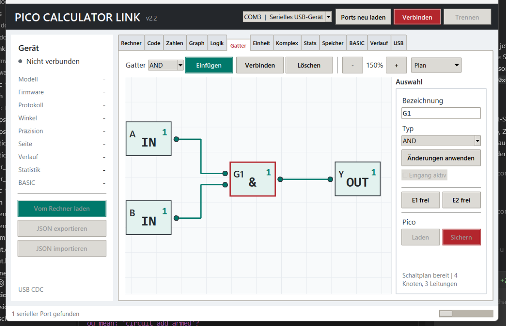

# Benutzerhandbuch: Pico Scientific Calculator

Gueltig fuer Firmware `2.2.0`, USB-Protokoll `5`, Pico Calculator Link `2.2`
und das LAFVIN Pico Development Kit mit RP2040, ST7796U-LCD und
GT911-Touchscreen.

## Inhalt

1. [Schnellstart](#1-schnellstart)
2. [Bedienung](#2-bedienung)
3. [Rechnen mit BASIC und SCIENTIFIC](#3-rechnen-mit-basic-und-scientific)
4. [TOOLS, Speicher und Verlauf](#4-tools-speicher-und-verlauf)
5. [Variablen, Funktionen und Favoriten](#5-variablen-funktionen-und-favoriten)
6. [Graphen und numerische Analyse](#6-graphen-und-numerische-analyse)
7. [PROGRAMMER](#7-programmer)
8. [FORMAT, Zweierkomplement und IEEE-754](#8-format-zweierkomplement-und-ieee-754)
9. [Zahlentheorie und Primzahlen](#9-zahlentheorie-und-primzahlen)
10. [Schaltalgebra](#10-schaltalgebra)
11. [Einheiten und Konstanten](#11-einheiten-und-konstanten)
12. [Komplexe Zahlen](#12-komplexe-zahlen)
13. [Statistik](#13-statistik)
14. [BASIC-Programmierung](#14-basic-programmierung)
15. [Pico Calculator Link](#15-pico-calculator-link)
16. [Speicherung und Werksreset](#16-speicherung-und-werksreset)
17. [Meldungen und Fehlerbehebung](#17-meldungen-und-fehlerbehebung)
18. [Grenzen und technische Hinweise](#18-grenzen-und-technische-hinweise)

## 1. Schnellstart

### Firmware installieren

Die fertige Datei befindet sich nach dem Build unter:

```text
out/firmware/bin/lafvin_scientific_calculator.uf2
```

So wird sie auf den Pico uebertragen:

1. Pico vom USB-Anschluss trennen.
2. Die Taste `BOOTSEL` auf dem Pico gedrueckt halten und USB wieder verbinden.
3. `BOOTSEL` loslassen, sobald das Laufwerk `RPI-RP2` erscheint.
4. `lafvin_scientific_calculator.uf2` auf dieses Laufwerk kopieren.
5. Der Pico startet danach automatisch mit dem Rechner.

Beim normalen Einschalten sind keine weiteren Schritte notwendig. LCD und
Touchscreen werden von der Firmware initialisiert.

### Erste Rechnung

1. Auf `BASIC` nacheinander `1`, `.`, `2`, `5`, `+`, `2`, `.`, `7`, `5`
   antippen.
2. `=` oder die Hardwaretaste `K1` druecken.
3. Das Ergebnis `4` erscheint im Datenbereich.
4. Mit `ANS`, `*`, `2`, `=` wird mit dem Ergebnis weitergerechnet.

### Wissenschaftliches Beispiel

1. Mit der linken oberen Seitentaste von `BASIC` zu `SCIENTIFIC` wechseln.
2. `DEG` waehlen.
3. `SIN`, `3`, `0`, `)`, `=` eingeben.
4. Das Ergebnis ist naeherungsweise `0.5`.

### Beispiel fuer exakte Dezimalrechnung

Der Ausdruck

```text
1.000000000000000000000000000000000000000000001*2
```

liefert exakt:

```text
2.000000000000000000000000000000000000000000002
```

Dieser Wert bleibt auch bei einer folgenden Rechnung mit `ANS`, im Verlauf,
ueber USB und nach einem Neustart erhalten.

Sehr lange Ausdruecke und Ergebnisse werden passend zur Displayausrichtung
automatisch auf mehrere Zeilen verteilt. Reicht der Platz nicht aus, wird die
Schrift stufenweise verkleinert. Der vollstaendige Wert bleibt dabei erhalten.

## 2. Bedienung

### Touchscreen

Die meisten Funktionen werden ueber das Tastenfeld am unteren Bildschirmrand
bedient. Eine Taste wird einmal kurz angetippt. Die Beschriftung passt sich
automatisch an die verfuegbare Tastengroesse an.

Wichtige allgemeine Tasten:

| Taste | Funktion |
|---|---|
| `=` | Ausdruck auswerten |
| `DEL` | Zeichen links vom Cursor loeschen |
| `AC` | Aktuelle Eingabe loeschen |
| `ANS` | Letztes normales Rechenergebnis einfuegen |
| `DEG` / `RAD` | Winkelmodus umschalten |
| linke obere Taste | Zur naechsten Hauptebene wechseln |

Funktionstasten wie `SIN`, `SQRT` oder `POLAR` fuegen automatisch die
oeffnende Klammer ein. Die schliessende Klammer `)` muss selbst eingegeben
werden.

### Hardwaretasten

| Taste | Normale Seiten | STATS | CODE | CIRCUIT |
|---|---|---|---|---|
| `K1` | Entspricht `=` | Entspricht `ADD` | Speichert die Eingabezeile | Eingang schalten oder Link starten |
| `K2` kurz | Drei Displaylayouts | Drei Displaylayouts | Drei Displaylayouts | Zoom 100/150/200 % |
| `K2` 0,8 s halten | Portrait/Landscape | Portrait/Landscape | Portrait/Landscape | Portrait/Landscape |

Werden `K1` und `K2` beim Einschalten gleichzeitig gehalten, setzt die
Firmware den gespeicherten Zustand bei der Initialisierung zurueck. Die Tasten
erst loslassen, wenn die Anzeige startet.

### Joystick

Der Joystick ist kontextabhaengig:

- Im Ausdruckseditor bewegt links/rechts den Cursor.
- In Programmlisten wird geblaettert oder die Auswahl bewegt.
- Im Statistikmodus werden Zeile und X-/Y-Feld gewaehlt.
- Im Graphen verschiebt er den Ausschnitt oder den Trace-Cursor.
- In `CIRCUIT` scrollt er die Schaltplanflaeche kontinuierlich.

### Displayansichten

`K2` durchlaeuft auf den tastenbasierten Seiten drei Layouts:

- **Standard:** grosseres Tastenfeld und kompakter Datenbereich.
- **Datenfokus:** doppelt hoher Datenbereich mit groesserer Schrift und
  Diagrammflaeche; das Tastenfeld wird halb so hoch.
- **Vollbild:** das Tastenfeld wird ausgeblendet und die Ausgabe verwendet die
  gesamte Anzeigeflaeche.

Die Touchbereiche werden zusammen mit dem sichtbaren Layout umgestellt. Im
Vollbild reagieren keine unsichtbaren Tastaturfelder. Ein weiterer Druck auf
`K2` kehrt zum Standardlayout zurueck. Nach einem Neustart beginnt der Rechner
wieder im Standardlayout.

`CIRCUIT` verwendet unabhaengig davon immer die komplette Anzeige als
Schaltplanflaeche. Ein kurzer Druck auf `K2` blendet dort keine Tastatur ein,
sondern wechselt zyklisch zwischen 100, 150 und 200 Prozent Zoom.

### Displayorientierung

K2 mindestens 0,8 Sekunden halten, bis ein kurzer Signalton erklingt. Die
Anzeige wechselt dann zwischen:

- **Landscape:** `480x320` Pixel.
- **Portrait:** `320x480` Pixel.

Renderer, Tasten und Touchkoordinaten drehen gemeinsam. Im schmaleren
Portraitmodus werden lange Tastenbezeichnungen gekuerzt; ihre Funktion bleibt
unveraendert. Ein kurzer K2-Druck schaltet weiterhin nur das Tastaturlayout.
Die Umschaltung und die Touchzuordnung wurden auf dem LAFVIN-Board in beiden
Orientierungen geprueft. Nach einem Neustart beginnt die Firmware in
Landscape.

Empfohlener Ablauf:

1. K2 gedrueckt halten und erst nach dem Signalton loslassen.
2. Das Board entsprechend der neuen Anzeigeorientierung drehen.
3. Eine sichtbare Taste kurz antippen. Ihre Touchflaeche liegt in beiden
   Orientierungen direkt auf der gezeichneten Taste.
4. Fuer die Rueckkehr K2 erneut mindestens 0,8 Sekunden halten.

Der aktuelle Tastaturzustand bleibt beim Drehen erhalten. Standard,
Datenfokus und Vollbild koennen daher in Landscape und Portrait unabhaengig
verwendet werden.

### Seitenfolge

Die linke obere Taste fuehrt durch folgende Ebenen:

```text
BASIC -> SCIENTIFIC -> PROGRAMMER -> FORMAT -> TOOLS -> SYMBOLS
      -> LOGIC -> UNITS -> COMPLEX -> STATS -> CODE -> BASIC
```

Der Graph wird von `TOOLS` aus mit `GRAPH` geoeffnet. `CODE` besitzt eine
eigene Taste `CALC`, um zum normalen Rechner zurueckzukehren.

## 3. Rechnen mit BASIC und SCIENTIFIC

### Ausdruckseingabe

Der normale Editor nimmt bis zu 191 Zeichen auf und beachtet die uebliche
Operatorrangfolge:

1. Klammern
2. Potenzen
3. Multiplikation, Division und Modulo
4. Addition und Subtraktion

Beispiele:

| Eingabe | Ergebnis |
|---|---:|
| `2+3*4` | `14` |
| `(2+3)*4` | `20` |
| `2^3^2` | `512` |
| `10%3` | `1` |
| `1/8` | `0.125` |

`%` ist der Divisionsrest (Modulo), keine Prozentrechnung. Zehn Prozent von
80 werden als `80*10/100` eingegeben.

Nach einer Auswertung kann ein Operator direkt an das Ergebnis angehaengt
werden. Der Rechner setzt dabei intern `ANS` als linken Operanden ein.

Lange Ausdruecke und Ergebnisse werden automatisch auf mehrere Displayzeilen
verteilt. Die Zeilenbreite richtet sich nach Landscape oder Portrait und nach
der aktuell verfuegbaren Anzeigeflaeche. Passt der vollstaendige Text mit der
normalen Schriftgroesse nicht in den Datenbereich, verkleinert der Rechner die
Schrift stufenweise, statt Stellen am Anfang oder Ende abzuschneiden.

### Exakte und angenaeherte Ergebnisse

Der normale Ausdruckseditor kombiniert exakte Dezimalarithmetik mit einem
hochpraezisen wissenschaftlichen Kern:

- Reine Dezimalarithmetik mit `+`, `-`, `*`, `/`, `%`, Klammern,
  ganzzahligen Potenzen und `ANS` verwendet die gewaehlte Stellenzahl.
- Endliche Ergebnisse bleiben innerhalb dieser Kapazitaet exakt.
- Periodische Divisionen werden nach 40, 80 oder 128 Stellen mit
  Round-to-even gerundet.
  Die Statuszeile zeigt dann `ROUNDED`.
- Wissenschaftliche Funktionen, allgemeine Potenzen, F1-F3 sowie `pi`, `e`,
  `tau` und `phi` verwenden passend zum Modus 192, 320 oder 512 Bit.
  Gerundete Resultate werden ebenfalls mit `ROUNDED` gekennzeichnet.
- A-F und das Speicherregister M bewahren ebenfalls den vollstaendigen
  Dezimaltext. Graph, Statistik, komplexe Zahlen und BASIC-Programme verwenden
  weiterhin eine binaere `double`-Naeherung.

Beispiele:

| Eingabe | Verhalten |
|---|---|
| `0.1+0.2` | exakt `0.3` |
| `9007199254740993+1` | exakt `9007199254740994` |
| `1/3` | auf die gewaehlte Stellenzahl gerundet, Status `ROUNDED` |
| `sqrt(2)` | Multipraezisions-Naeherung mit 40, 80 oder 128 Stellen |
| `sin(pi/6)` | Multipraezisions-Naeherung im aktiven Modus |
| `A+0.1` | Hochpraezise Rechnung mit dem vollstaendigen A-F-Wert |

Wird die Kapazitaet eines exakten Zwischenergebnisses ueberschritten, erscheint
`RANGE ERROR`. In diesem Fall kann eine wissenschaftliche Schreibweise oder
eine umgestellte Rechnung helfen.

### Praezisionsmodus

Auf `TOOLS` zeigt eine Taste den aktiven Modus und schaltet ihn bei jedem
Druck weiter:

| Taste | Modus | Ausgabe | LibBF-Arbeitsgenauigkeit |
|---|---|---:|---:|
| `P40` | NORMAL | 40 signifikante Stellen | 192 Bit |
| `P80` | HIGH | 80 signifikante Stellen | 320 Bit |
| `P128` | ULTRA | 128 signifikante Stellen | 512 Bit |

HIGH ist die Werkseinstellung. Der Modus erscheint in der Statuszeile, gilt
sofort fuer die naechste Berechnung und wird im Flash gespeichert. ULTRA
liefert die hoechste Genauigkeit, benoetigt fuer transzendente Funktionen aber
mehr Rechenzeit.

### Winkelmodus

`DEG` und `RAD` gelten fuer:

- `sin`, `cos`, `tan`
- `asin`, `acos`, `atan`
- Phase und polare Darstellung komplexer Zahlen

Der aktive Modus steht auf der Taste. Graphfunktionen werden unabhaengig davon
immer mit `x` im Bogenmass ausgewertet.

### Wissenschaftliche Funktionen

| Taste/Ausdruck | Bedeutung | Beispiel |
|---|---|---|
| `sin(x)`, `cos(x)`, `tan(x)` | Trigonometrie | `sin(30)` in DEG |
| `asin(x)`, `acos(x)`, `atan(x)` | Umkehrfunktionen | `atan(1)` |
| `sinh(x)`, `cosh(x)`, `tanh(x)` | Hyperbelfunktionen | `sinh(1)` |
| `ln(x)` | Natuerlicher Logarithmus | `ln(e)` |
| `log(x)` | Zehnerlogarithmus | `log(100)` |
| `log10(x)` | Alias fuer den Zehnerlogarithmus | `log10(100)` |
| `exp(x)` | Exponentialfunktion | `exp(1)` |
| `sqrt(x)` | Quadratwurzel | `sqrt(2)` |
| `abs(x)` | Betrag | `abs(-4)` |
| `floor(x)` | Abrunden | `floor(2.9)` |
| `ceil(x)` | Aufrunden | `ceil(2.1)` |
| `pow(x,y)` | Allgemeine Potenz | `pow(2,0.5)` |
| `atan2(y,x)` | Quadrantenrichtiger Arkustangens | `atan2(1,-1)` |
| `fac(n)` | Fakultaet | `fac(5)` |
| `ncr(n,r)` | Kombinationen | `ncr(6,2)` |
| `npr(n,r)` | Permutationen | `npr(6,2)` |
| `pi`, `e` | Mathematische Konstanten | `2*pi` |
| `tau`, `phi` | Kreiszahl `2*pi` und goldener Schnitt | Eingabe ueber USB/PC |

`log10`, `ceil`, `pow`, `atan2`, `tau` und `phi` besitzen keine eigenen
LCD-Tasten. Sie koennen ueber Pico Calculator Link, einen USB-Befehl oder eine
entsprechend synchronisierte Favoritentaste in den Editor gelangen. Fuer
`pow(x,y)` steht am LCD alternativ der Operator `x^y` bereit.

Bei `ncr` und `npr` trennt das Komma die beiden Argumente. Fakultaet,
Kombinationen und Permutationen erwarten nichtnegative ganze Zahlen;
`fac(n)` ist bis `n=170` vorgesehen.

## 4. TOOLS, Speicher und Verlauf

### Speicherregister

| Taste | Funktion |
|---|---|
| `M+` | `ANS` zum Speicher addieren |
| `M-` | `ANS` vom Speicher abziehen |
| `MR` | Speicherwert in den Editor einfuegen |
| `MC` | Speicher auf null setzen |

Das Speicherregister bewahrt wie `ANS` bis zu 128 signifikante Stellen. `M+`,
`M-` und `MR` verwenden den vollstaendigen Dezimaltext; der Wert wird
automatisch im Flash gespeichert.

### Verlauf

Der normale Rechner speichert die letzten acht erfolgreichen Berechnungen.

1. `PREV` oder `NEXT` waehlt einen Eintrag.
2. `USE` laedt Ausdruck und Ergebnis wieder in den Rechner.
3. `HCLR` loescht den gesamten normalen Verlauf.

Exakte Dezimalergebnisse werden im Verlauf nicht auf `double` gekuerzt.

### Cursorwerkzeuge

`<`, `>` und `END` bewegen den Eingabecursor. An der frueheren `HOME`-Position
liegt die Praezisionstaste `P40`/`P80`/`P128`. `DEL` loescht links vom Cursor.
Diese Tasten sind besonders bei langen Funktionen und Graphausdruecken
hilfreich.

## 5. Variablen, Funktionen und Favoriten

### Variablen A bis F

1. Gewuenschten Wert normal berechnen.
2. Zu `SYMBOLS` wechseln.
3. Zum Beispiel `A=ANS` druecken.
4. `A` fuegt die Variable spaeter in einen Ausdruck ein und wechselt zu
   `TOOLS`.

A-F bewahren bis zu 128 signifikante Stellen und werden vom hochpraezisen
wissenschaftlichen Kern ausgewertet. Fuer Graphen wird parallel eine
`double`-Naeherung gehalten, damit das LCD schnell genug abgetastet werden kann.

### Benutzerfunktionen F1 bis F3

Eine Funktion wird als Ausdruck in `x` definiert:

1. `TOOLS` oeffnen und beispielsweise `x^2+1` eingeben.
2. Zu `SYMBOLS` wechseln.
3. `F1` waehlen und `SAVE` druecken.
4. Die Funktion mit `f1(3)` aufrufen.

Alternativ laedt `EDIT` die Definition der ausgewaehlten Funktion nach
`TOOLS`. Dort kann sie geaendert und anschliessend wieder mit `SAVE`
gespeichert werden. Eine leere Definition loescht die Funktion.

F1-F3 duerfen A-F, `ANS`, `x`, normale mathematische Funktionen und bereits
definierte Benutzerfunktionen verwenden. Direkte oder indirekte Rekursion wird
abgelehnt.

### Favoritentasten

Die sechs Tasten `FAV1` bis `FAV6` fuegen haeufig verwendete Texte in den
Editor ein. So wird eine Taste belegt:

1. Den gewuenschten Ausdruck im normalen Editor vorbereiten.
2. `SYMBOLS` oeffnen.
3. Passendes `SET1` bis `SET6` druecken.

Die Belegung bleibt nach einem Neustart erhalten.

## 6. Graphen und numerische Analyse

### Funktion zeichnen

1. Im Graphen `MORE` und danach `EDIT` druecken. Dadurch wird der aktuell
   gewaehlte Funktionsplatz im `TOOLS`-Editor geoeffnet.
2. Den Ausdruck mit der direkten `X`-Taste eingeben, zum Beispiel `sin(x)`.
   `X` liegt in der unteren Tastenreihe und bleibt auch im Datenfokus sichtbar.
3. `GRAPH` druecken. Der Ausdruck wird im ausgewaehlten Funktionsplatz
   gespeichert und die y-Achse automatisch skaliert.
4. Mit `F1`, `F2` oder `F3` den aktiven Platz waehlen.
5. `ON/OFF` blendet die ausgewaehlte Funktion ein oder aus.

Die drei Farben sind:

| Funktion | Farbe |
|---|---|
| F1 | Cyan |
| F2 | Gelb |
| F3 | Magenta |

Das feine Koordinatengitter, die Achsenbeschriftung und farbige Kurven werden
dynamisch an den sichtbaren Bereich angepasst. Farbige Kreuze markieren
Nullstellen, weisse Kreuze Schnittpunkte.

### Graph bedienen

- Joystick links/rechts/oben/unten verschiebt den sichtbaren Bereich.
- `MORE -> AUTO` passt die y-Achse an alle sichtbaren Funktionen an.
- `MORE -> RANGE` oeffnet die Bereichseinstellung.
- `XW-` und `XW+` verkleinern oder vergroessern die x-Spanne.
- `YW-` und `YW+` veraendern die y-Spanne.
- `RESET` stellt den Standardbereich wieder her.
- `TOOLS` kehrt zum Ausdruckseditor zurueck.

### Trace und Tabelle

`MORE -> TRACE` aktiviert einen Cursor auf der ausgewaehlten Funktion. Der
Joystick bewegt ihn links oder rechts; x- und y-Wert stehen im Datenbereich.

`MORE -> TABLE` zeigt diskrete Funktionswerte:

- `X-` und `X+` scrollen durch die x-Werte.
- `STEP-` und `STEP+` aendern die Schrittweite.
- `AUTO` passt den sichtbaren Wertebereich an.

### Numerische Analyse

`MORE -> ANALYZE` bietet:

| Taste | Funktion |
|---|---|
| `ROOT` | Nullstelle der ausgewaehlten Funktion |
| `XING` | Schnittpunkt mit der naechsten aktiven Funktion |
| `DERIV` | Numerische Ableitung am Trace-x-Wert |
| `INTEGR` | Bestimmtes Integral ueber das Analyseintervall |
| `EXTREM` | Lokale Minima und Maxima im Intervall |

Standardmaessig wird der sichtbare x-Bereich verwendet. Explizite Grenzen werden
so gesetzt:

1. Unter `BASIC` oder `SCIENTIFIC` den ersten Grenzwert berechnen.
2. Im Graph `ANALYZE -> MORE -> A=ANS` druecken.
3. Zweiten Grenzwert berechnen und entsprechend `B=ANS` verwenden.
4. `VIEW` schaltet wieder auf den sichtbaren x-Bereich zurueck.

`TOL` schaltet zwischen `1e-6`, `1e-9` und `1e-12`. Pro Verfahren sind
hoechstens 64 Iterationen vorgesehen. `NO CONVERGENCE` bedeutet, dass
Startwert, Bereich oder Toleranz angepasst werden sollten.

## 7. PROGRAMMER

PROGRAMMER verarbeitet wortbreitenabhaengige Ganzzahlen bis 64 Bit.

### Zahlenbasis wechseln

`DEC`, `HEX` und `BIN` schalten die Darstellung sofort um. Der gespeicherte
Bitwert bleibt dabei gleich. In HEX sind `A` bis `F` verfuegbar; in DEC oder
BIN werden ungueltige Ziffern mit `INVALID IN ...` abgelehnt.

Beispiel:

1. `DEC` waehlen und `255` eingeben.
2. `HEX` druecken: Anzeige `FF`.
3. `BIN` druecken: Anzeige `11111111`.

### Logische Operationen

Fuer eine binaere Operation:

1. Linken Wert eingeben.
2. `AND`, `OR` oder `XOR` druecken.
3. Rechten Wert eingeben.
4. `=` oder `K1` druecken.

`NOT`, `NEG`, `<<` und `>>` wirken sofort auf den aktuellen Wert. Alle
Operationen werden auf die in `FORMAT` eingestellte Wortbreite begrenzt.

`NEG` bildet das Zweierkomplement. `<<` und `>>` schieben um ein Bit.

## 8. FORMAT, Zweierkomplement und IEEE-754

FORMAT besitzt die Ansichten `CONV`, `BITS`, `F32` und `F64`.

### Wortbreite und Interpretation

`8BIT`, `16BIT`, `32BIT` oder `64BIT` bestimmen die aktive Wortbreite.
`SIGNED/UNSIGNED` schaltet die Dezimalinterpretation um. Der rohe Bitwert
aendert sich dabei nicht.

| Taste | Wirkung |
|---|---|
| `TCNEG` / `NEG` | Zweierkomplement bilden |
| `MASK` | Bits ausserhalb der Wortbreite entfernen |
| `SEXT` | Vorzeichen auf 64 Bit erweitern |
| `MIN` / `MAX` | Kleinsten/groessten signed Wert laden |
| `ZERO` / `ONES` | Alle Bits loeschen/setzen |
| `+1` / `-1` | Inkrementieren/dekrementieren |
| `ROL` / `ROR` | Bitweise rotieren |
| `SWAP` | Byte-Reihenfolge umkehren |

`C` zeigt Carry, `V` signed Overflow. `C/V CLR` loescht beide Flags.

### Einzelbitbearbeitung

In der Ansicht `BITS`:

1. Mit `BIT-8`, `BIT-1`, `BIT+1`, `BIT+8` die Position waehlen.
2. Mit `SET`, `CLR` oder `TOGGLE` das ausgewaehlte Bit bearbeiten.

Die aktuelle Bitposition und die Wortbreite werden gespeichert.

### Festkomma

Der Programmerwert kann als Q-Festkommazahl interpretiert werden:

- `Q0`, `Q8`, `Q16`, `Q24` waehlen typische Nachkommabit-Zahlen.
- `Q-` und `Q+` aendern die Anzahl um ein Bit.
- Die Wortbreite muss groesser als die Zahl der Nachkommabits sein.

Bei einem Q16-Wert bedeutet der rohe Wert `98304` beispielsweise `1.5`, weil
`98304 / 2^16 = 1.5`.

### IEEE-754

| Taste | Funktion |
|---|---|
| `ANS>F32` | `ANS` als Float32 codieren und Bits anzeigen |
| `ANS>F64` | `ANS` als Float64 codieren und Bits anzeigen |
| `F32>ANS` | Aktuelle 32 Bit als Float32 nach `ANS` uebernehmen |
| `F64>ANS` | Aktuelle 64 Bit als Float64 nach `ANS` uebernehmen |
| `IEEE32` / `IEEE64` | Inspector oeffnen |

Der Inspector zeigt Vorzeichen, Roh-Exponent, Arbeitsexponent, Mantisse und
Klassifikation als Normal, Subnormal, Null, Unendlich oder NaN. Unendliche und
NaN-Werte koennen nicht nach `ANS` uebernommen werden.

## 9. Zahlentheorie und Primzahlen

`PRIMES` im Launcher arbeitet mit vorzeichenlosen Ganzzahlen von 0 bis
18446744073709551615. Mit `A`, `B` und `M` wird das aktive Eingabefeld
gewaehlt; Ziffern, `DEL` und `AC` bearbeiten den Wert. `ANS` setzt ein
ganzzahliges Rechnerergebnis ein, `MAX64` den groessten 64-Bit-Wert.

| Taste | Berechnung |
|---|---|
| `ggT/GCD` | Groesster gemeinsamer Teiler von A und B |
| `kgV/LCM` | Kleinstes gemeinsames Vielfaches von A und B |
| `PRIME?` | Deterministischer Primzahltest fuer A |
| `NEXT P` / `PREV P` | Naechste beziehungsweise vorherige Primzahl zu A |
| `FACT` | Primfaktorzerlegung von A |
| `PHI` | Eulersche Phi-Funktion von A |
| `MOD` | Rest A modulo B |
| `A^B MOD M` | Modulare Potenz mit Basis A, Exponent B und Modulus M |

`USE` setzt das letzte ganzzahlige Ergebnis in das aktive Feld ein. `>ANS`
uebernimmt es in den normalen Rechner, `SWAP` vertauscht A und B. Ein kgV-
Ueberlauf, Division durch null und nicht vorhandene benachbarte Primzahlen
werden als Fehler gemeldet.

## 10. Schaltalgebra

LOGIC verarbeitet Boolesche Ausdruecke mit A bis F.

### Operatoren und Rangfolge

Unterstuetzt werden `NOT`, `AND`, `OR`, `XOR`, `NAND`, `NOR`, `XNOR`, die
Konstanten `0` und `1` sowie Klammern.

Die Rangfolge ist:

1. `NOT`
2. `AND` und `NAND`
3. `XOR` und `XNOR`
4. `OR` und `NOR`

Mit Klammern wird die Reihenfolge explizit festgelegt.

### Wahrheitstabelle, KNF und DNF

1. Ausdruck eingeben, zum Beispiel `A XOR B`.
2. `CHECK` prueft Syntax und Gatterbaum und zeigt `OUT = 0/1` fuer die
   aktuelle Eingangsbelegung.
3. `TABLE` zeigt die Wahrheitstabelle; `UP` und `DOWN` blaettern.
4. `DNF` oder `KNF` zeigt die vereinfachte Form.
5. Dieselbe Taste erneut druecken, um die kanonische Form anzuzeigen.
6. `USE` uebernimmt die angezeigte Form in den Editor, sofern sie hineinpasst.

### Gatter-Simulation

`GATES` oeffnet die Live-Simulation. Die Tasten A bis F schalten die im
Ausdruck verwendeten Eingaenge. Eine helle Taste bedeutet logisch `1`.
Ausgang und Gatteranzahl werden unmittelbar aktualisiert.

Die Simulation basiert auf einem Ausdrucksbaum. Offene Leitungen oder
Rueckkopplungen koennen daher nicht dargestellt werden.

### Graphischer Schaltplaneditor

Die App `CIRCUIT` im Launcher ist ein davon unabhaengiger Vollbildeditor. Beim
ersten Start zeigt sie zwei Eingaenge `A` und `B`, ein AND-Gatter und den
Ausgang `Y`. Unterstuetzt werden `INPUT`, `OUTPUT`, `NOT`, `AND`, `OR`, `XOR`,
`NAND`, `NOR` und `XNOR`. Die Standardvergroesserung ist 150 Prozent.

Direkte Bedienung auf der Zeichenflaeche:

- Gate-Koerper antippen, um das Gate auszuwaehlen.
- Ein Gate ziehen, um es frei im Schaltplan zu verschieben.
- `INPUT` antippen, um den Pegel zwischen `0` und `1` umzuschalten.
- Einen Ausgangsport und danach einen Eingangsport antippen, um beide zu
  verbinden. Eine vorhandene Verbindung am Eingang wird dabei ersetzt.
- Einen bereits verbundenen Eingangsport ohne aktiven Link antippen, um die
  Leitung zu trennen.
- Mit dem Joystick links, rechts, oben oder unten durch die 1600 x 1200 Pixel
  grosse Arbeitsflaeche scrollen. Gedrueckthalten wiederholt die Bewegung.

Die obere Werkzeugleiste bleibt als schmale Einblendung ueber dem Schaltplan:

| Werkzeug | Funktion |
|---|---|
| `HOME` | Zum App-Launcher zurueckkehren |
| `+AND` usw. | Einfuegemodus fuer den angezeigten Gate-Typ aktivieren |
| `TYPE` | Typ des ausgewaehlten Gates aendern; ohne Auswahl den Einfuegetyp wechseln |
| `LINK` | Ausgang des ausgewaehlten Gates als Leitungsquelle verwenden oder abbrechen |
| `DEL` | Ausgewaehltes Gate samt angeschlossenen Leitungen loeschen |
| `Z-` / `Z+` | Schaltplan auf 100, 150 oder 200 Prozent verkleinern/vergroessern |

Im Einfuegemodus setzt ein Tipp auf eine freie Stelle ein Gate. Wird stattdessen
ein Port angetippt, entsteht das neue Gate auf der passenden Seite und wird
sofort verbunden. Ein Tipp auf eine freie Stelle ohne Einfuegemodus hebt die
Auswahl und einen begonnenen Link auf. Rueckkopplungen werden mit
`LINK REJECTED` abgelehnt. Logische `1`-Leitungen erscheinen gelb, `0`-Leitungen
grau; das ausgewaehlte Gate ist gelb markiert.

Schaltplan, Eingangspegel, Verbindungen, Scrollposition und Zoomstufe werden
automatisch im Flash gespeichert.

## 11. Einheiten und Konstanten

### Umrechnung

Es stehen 68 Einheiten in zehn Kategorien bereit: Laenge, Flaeche, Volumen,
Masse, Zeit, Temperatur, Winkel, Druck, Energie und Leistung.

1. `UNITS` oeffnen und die Kategorie mit `<CAT` / `CAT>` auswaehlen.
2. `FROM` oder `TO` antippen und eine der sechs angezeigten Einheiten waehlen.
   Erneutes Antippen von `FROM` beziehungsweise `TO` zeigt die naechsten sechs
   Einheiten. Alternativ blaettern `<FROM`, `FROM>`, `<TO` und `TO>` einzeln.
3. Den Wert direkt mit dem Zahlenblock eingeben. Das Ergebnis wird nach jeder
   vollstaendigen Eingabe automatisch aktualisiert; `=` berechnet erneut.
4. Mit `ANS IN` kann weiterhin das letzte Rechnerergebnis als Eingangswert
   verwendet werden.
5. Mit `ANS OUT` das Ergebnis uebernehmen oder mit `>EDIT` einen neuen
   Rechenausdruck beginnen.

Der Zahlenblock besitzt `0` bis `9`, Dezimalpunkt, `+/-`, `DEL` und `AC`.
`EE` gibt einen Zehnerexponenten ein: `1`, `EE`, `+/-`, `3` entspricht
`1e-3`.

`SWAP` vertauscht Quell- und Zieleinheit und verwendet das bisherige Ergebnis
als neuen Eingangswert. Temperaturen unter dem absoluten Nullpunkt werden
abgelehnt. `AC` loescht die direkte Eingabe.

### Physikalische Konstanten

`CONST` oeffnet die Liste mit zwoelf Konstanten. `C-` und `C+` blaettern.
`C>ANS` uebernimmt den Wert als Ergebnis, `C>EDIT` setzt ihn in den Editor.
`INFO` zeigt die Quellenangabe.

## 12. Komplexe Zahlen

COMPLEX besitzt einen eigenen Editor, Ergebniszustand und Verlauf.

### Eingabe

| Eingabe | Bedeutung |
|---|---|
| `3+4i` | Kartesische Zahl |
| `(1+i)(1-i)` | Implizite Multiplikation |
| `conj(3+4i)` | Konjugierte Zahl |
| `abs(3+4i)` | Betrag |
| `arg(3+4i)` | Phase |
| `polar(5,30)` | Betrag 5, Winkel 30 Grad im DEG-Modus |

Zwischen Zahl und `i` ist kein `*` notwendig. `CART/POLAR` aendert nur die
Darstellung des Ergebnisses. `DEG/RAD` gilt fuer Phase und Polardarstellung.

Nach `=` kann mit `+`, `-`, `*` oder `/` direkt am gesamten Ergebnis
weitergerechnet werden.

### Komplexer Verlauf

`HIST` oeffnet acht eigene Eintraege. `PREV`, `NEXT` und `USE` navigieren und
laden einen Eintrag. `HCLR` loescht nur den komplexen Verlauf; `BACK` kehrt zum
komplexen Editor zurueck.

## 13. Statistik

STATS speichert bis zu 32 Werte oder Wertepaare.

### 1VAR

1. `1VAR` waehlen.
2. X-Wert eingeben.
3. `ADD` oder `K1` druecken.

### 2VAR

1. `2VAR` waehlen.
2. X-Wert eingeben.
3. Mit `X/Y` zum Y-Feld wechseln.
4. Y-Wert eingeben.
5. `ADD` oder `K1` druecken.

`ANS` laedt das letzte normale Ergebnis in das aktive Feld. Wissenschaftliche
Schreibweise wird mit `EXP` eingegeben.

### Liste bearbeiten

- `PREV` / `NEXT`: Zeile auswaehlen.
- `EDIT`: Gewaehlte Zeile in die Eingabefelder laden.
- `ADD`: Aenderung speichern.
- `DROP`: Gewaehlte Zeile entfernen.
- `CLEAR`: Gesamte Liste leeren.
- Joystick links/rechts: Zeile waehlen.
- Joystick oben/unten: X- oder Y-Feld waehlen.

### Auswertung

`SUM` zeigt Anzahl, Mittelwert, Median, Minimum, Maximum sowie Populations- und
Stichproben-Standardabweichung. In `2VAR` waehlt `X/Y` die Spalte.

`REG` zeigt bei mindestens zwei Wertepaaren:

- lineare Regressionsfunktion
- Korrelationskoeffizient `r`
- Bestimmtheitsmass `r^2`

`PLOT` zeichnet in `1VAR` ein Histogramm und in `2VAR` ein Streudiagramm mit
gestrichelter Regressionsgerade.

## 14. BASIC-Programmierung

### Programmeditor

Die Taste `CODE` auf der Statistikseite oeffnet die Programmierung. Ein
Programm besitzt bis zu 20 nummerierte Zeilen. Hinter der Zeilennummer sind
bis zu 63 Zeichen pro Anweisung moeglich.

Eine Zeile wird vollstaendig eingegeben und mit `ENTER` oder `K1` gespeichert:

```basic
10 PRINT "HELLO"
```

Nur die Zeilennummer mit `ENTER` loescht die betreffende Zeile:

```basic
10
```

Der Joystick bewegt den Cursor und scrollt die Programmliste. Ein Tippen auf
den oberen Bildschirmbereich wechselt zwischen Liste und Ausgabe. `K2`
durchlaeuft die grosse, kompakte und vollstaendig ausgeblendete Tastatur.
Im Vollbild zeigt CODE bis zu 16 Ausgabezeilen. Die Standardansicht zeigt in
Landscape bis zu sechs und in Portrait bis zu zehn Zeilen. Lange Ausgaben
werden an der verfuegbaren LCD-Breite automatisch auf weitere Bildschirmzeilen
umgebrochen. Landscape zeigt bei der grossen Ausgabeschrift bis zu 39 Zeichen
pro Zeile, Portrait bis zu 25 Zeichen; Text wird dabei nicht mehr am rechten
Rand abgeschnitten.

### Tastaturebenen

- `ABC`: QWERTZ-Tastatur fuer Buchstaben, Zahlen und Zeichen.
- `TOK`: Direkttasten fuer BASIC-Woerter und Operatoren.

Die Token-Ebene fuegt `LET`, `PRINT`, `INPUT`, `IF`, `THEN`, `GOTO`, `FOR`,
`TO`, `STEP`, `NEXT`, `END`, `CLS` und `REM` mit passenden Leerzeichen ein.
Die Anfuehrungszeichen-Taste `"` wird fuer Textausgabe verwendet.

### Sprachumfang

| Anweisung | Beispiel | Funktion |
|---|---|---|
| `PRINT` | `10 PRINT "READY"` | Text oder Zahl ausgeben |
| `LET` | `20 LET A=5` | Variable setzen; `LET` ist optional |
| `INPUT` | `30 INPUT B` | Wert oder Ausdruck anfordern |
| `IF/THEN` | `40 IF B<0 THEN 80` | Bedingter Sprung |
| `GOTO` | `50 GOTO 20` | Unbedingter Sprung |
| `FOR` | `60 FOR I=1 TO 10 STEP 2` | Schleife starten |
| `NEXT` | `70 NEXT I` | Schleife fortsetzen |
| `CLS` | `80 CLS` | Ausgabe loeschen |
| `REM` | `90 REM KOMMENTAR` | Kommentar |
| `END` | `100 END` | Programm beenden |

Es stehen A bis Z zur Verfuegung. Ausdruecke unterstuetzen unter anderem
`SIN`, `COS`, `SQRT`, `ABS`, `EXP` und `PI()`.

### Ausfuehren

- `RUN` startet das Programm und wird waehrenddessen zu `STOP`.
- Bei `INPUT` erscheint ein Eingabestatus. Wert eingeben und bestaetigen.
- `NEW` muss zweimal gedrueckt werden und loescht danach das Programm.
- `CALC` verlaesst CODE und kehrt zum Rechner zurueck.

Nach 5000 ausgefuehrten Anweisungen beendet `STEP LIMIT` das Programm. Das
verhindert, dass eine Endlosschleife die Bedienung blockiert.

### Beispielprogramm

```basic
10 CLS
20 FOR I=1 TO 5
30 PRINT I^2
40 NEXT I
50 END
```

Weitere ladbare Programme liegen unter `examples/basic/`, darunter Schleifen,
Verzweigungen, Fakultaet, Trigonometrie und ein Mandelbrot-Textbild.

## 15. Pico Calculator Link

Die Desktop-Anwendung Pico Calculator Link `2.2` steuert und synchronisiert
den Rechner ueber dessen normalen USB-Anschluss.



### Voraussetzungen und Start

Python 3.9 oder neuer und PySerial werden benoetigt:

```sh
python -m pip install -r tools/requirements.txt
python tools/pico_calc_gui.py
```

Unter Linux kann zusaetzlich `python3-tk` notwendig sein. Unter Windows und
macOS muss Python mit Tk/Tcl installiert sein. Diese Version der Anwendung
erwartet Firmware `2.2.0` mit USB-Protokoll `5`.

### Verbindung

1. Pico normal per USB verbinden.
2. Anwendung starten.
3. Angezeigten seriellen Port waehlen, unter Windows beispielsweise `COM5`.
4. `Verbinden` druecken.

Die Geraeteleiste zeigt Firmware, Protokoll, Winkel- und Praezisionsmodus,
Seite und Datenzaehler.

### Bereiche der Anwendung

| Bereich | Verwendung |
|---|---|
| `Rechner` | Wissenschaftlichen Ausdruck senden, Ergebnis anzeigen sowie DEG/RAD und NORMAL/HIGH/ULTRA schalten |
| `Code` | BIN/DEC/HEX, Bitoperationen, 2er-Komplement, Q-Fixpunkt und IEEE-754 untersuchen |
| `Zahlen` | GGT/KGV, Primzahltest, benachbarte Primzahlen, Faktorisierung, Phi, Modulo und modulare Potenz berechnen |
| `Graph` | F1-F3 plotten sowie Nullstelle, Schnittpunkt, Ableitung, Integral und Extrema berechnen |
| `Logik` | Gatterbelegung auswerten, Wahrheitstabelle sowie vereinfachte oder kanonische DNF/KNF erzeugen |
| `Gatter` | Grafischen Schaltplan laden, bearbeiten, simulieren und zum Pico schreiben |
| `Einheit` | Alle Einheitenkategorien umrechnen und physikalische Konstanten lesen |
| `Komplex` | Komplexe Ausdruecke in kartesischer und polarer Form berechnen |
| `Stats` | Werte oder Wertepaare verwalten, Summary, Regression und Histogramm berechnen |
| `Speicher` | A-F, F1-F3, M und FAV1-FAV6 bearbeiten und synchronisieren |
| `BASIC` | `.bas` laden, speichern, uebertragen und ausfuehren |
| `Verlauf` | Acht Recheneintraege lesen und wiederverwenden |
| `USB` | Einzelne USB-Befehle senden und Antworten ansehen |

Fuer Berechnungen und die Anzeige verwendet die Anwendung den vom Pico
gelieferten Dezimaltext. Im JSON-Export sind `result_text`, A-F und M die
autoritativen Textfelder. Das zusaetzliche Feld `result` ist nur eine
angenaherte Gleitkomma-Kopie fuer einfache externe Werkzeuge.

Alle mathematischen Modulberechnungen laufen auf dem Pico. Die PC-App zeichnet
Ergebnisse wie Graphen und Tabellen nur auf; Rechenkern, Winkelmodus,
Bereichspruefung und Fehlermeldungen stammen aus derselben Firmware wie die
LCD-Bedienung. Der Gattereditor spiegelt Pegel zusaetzlich lokal, damit sie
waehrend des Bearbeitens sofort sichtbar sind. Bei
Graphen werden F1-F3 und der sichtbare Bereich vor dem Plotten synchronisiert.
Eine Wahrheitstabelle kann je nach Ausdruck bis zu 64 Zeilen besitzen.

### Grafischer Gattereditor am PC

`Pico -> Laden` liest Gates, Leitungen, Pegel, Ausschnitt und Zoom. Zum Bearbeiten
wird ein Gattertyp gewaehlt und `Einfuegen` gedrueckt; der naechste Klick auf
die Zeichenflaeche setzt das Symbol. Gates lassen sich mit der linken
Maustaste ziehen. Ein Klick auf einen Ausgangsport und danach auf einen
Eingangsport verbindet beide. Rechtsklick auf einen belegten Eingangsport
oder die Trennen-Tasten in der Auswahlleiste loest die Leitung.

Ein INPUT wird per Doppelklick oder ueber `Eingang aktiv` geschaltet. Typ und
Bezeichnung des ausgewaehlten Knotens koennen rechts bearbeitet werden. Ziehen
auf freier Flaeche verschiebt den Ausschnitt; Mausrad sowie `-` und `+`
wechseln zwischen 100, 150 und 200 Prozent. Das Menue `Plan` erstellt einen
leeren Plan oder laedt die AND-Demo. `Pico -> Sichern` validiert den gesamten
Plan auf Portfehler, Kapazitaet und Zyklen und speichert ihn danach persistent
auf dem Geraet.

### BASIC ueber den PC

Im Tab `BASIC` kann ein Programm als `.bas`-Datei geladen, zum Rechner
geschrieben und mit `Ausfuehren` gestartet werden. Bei `INPUT` erscheint ein
Eingabefeld. Die Programmausgabe wird fortlaufend vom Rechner gelesen.

### JSON-Sicherung

Der Export im JSON-Format 6 erfasst Ausdruck, exaktes Ergebnis, Winkel- und
Praezisionsmodus, A-F, F1-F3, Speicher M, Favoriten, Programmer- und
Zahlenformatzustand, Graphbereich, Verlauf, Statistik, BASIC-Programm sowie
den Schaltplan mit Pegeln, Leitungen, Viewport und Zoom.
Beim Import werden Ausdruck, Winkel- und Praezisionsmodus, A-F, F1-F3, M,
Favoriten, Programmer- und Zahlenformatzustand, Graphbereich, Statistik,
BASIC-Programm und Schaltplan zurueckgeschrieben. `ANS` und Verlauf sind
Export- und Protokolldaten und werden nicht importiert. Abhaengige
Benutzerfunktionen werden in einer gueltigen Reihenfolge uebertragen.

### Kommandozeile

```sh
python tools/pico_calc_cli.py ports
python tools/pico_calc_cli.py --port COM5 info
python tools/pico_calc_cli.py --port COM5 eval "sqrt(2)"
python tools/pico_calc_cli.py --port COM5 export calculator-state.json
python tools/pico_calc_cli.py --port COM5 import calculator-state.json
```

## 16. Speicherung und Werksreset

Automatisch gespeichert werden:

- Winkel- und Praezisionsmodus sowie `ANS`
- Speicherregister und letzte Seite
- Programmer-Wortbreite, Basis, signed-Modus und Bitposition
- normaler Rechenverlauf
- A-F, F1-F3 und Favoriten
- Graphfunktionen und Bereiche
- Statistikmodus und Datensaetze
- BASIC-Programm
- Schaltplan mit Gates, Leitungen, Eingangspegeln und Scrollposition

Aenderungen werden etwa drei Sekunden gesammelt. Vor dem Trennen der
Stromversorgung sollte deshalb kurz gewartet werden, wenn gerade Daten
geaendert wurden.

Zwei je 8 KiB grosse, CRC-geschuetzte Flashslots werden abwechselnd beschrieben. Ein
Stromausfall waehrend des Speicherns zerstoert dadurch nicht den vorherigen
gueltigen Zustand. Firmware 2.2 akzeptiert ausschliesslich Flashformat 8.
Aeltere Formate werden bewusst nicht migriert; nach einem Update startet der
Rechner mit Werkseinstellungen.

### Werksreset

1. Pico ausschalten.
2. `K1` und `K2` gleichzeitig gedrueckt halten.
3. Pico einschalten und beide Tasten halten, bis die Anzeige startet.
4. Tasten loslassen.
5. Die Meldung `FACTORY RESET` bestaetigt das Loeschen.

Der Werksreset entfernt alle benutzerdefinierten Funktionen, Favoriten, den
normalen Verlauf, Statistikdaten, BASIC-Programme und Schaltplaene.

## 17. Meldungen und Fehlerbehebung

### Typische Statusmeldungen

| Meldung | Bedeutung und Abhilfe |
|---|---|
| `OK` | Operation erfolgreich |
| `ROUNDED` | Ergebnis wurde reproduzierbar auf die aktive Stellenzahl gerundet |
| `ENTER EXPRESSION` | Editor ist leer |
| `SYNTAX ERROR` / `SYNTAX AT n` | Klammern, Operatoren oder Argumente pruefen |
| `MATH ERROR` | Mathematisch ungueltiger Wert, etwa `sqrt(-1)` im reellen Modus |
| `RANGE ERROR` | Ergebnis oder exaktes Zwischenergebnis ueberschreitet den Bereich |
| `NO CONVERGENCE` | Graphbereich, Startwert oder Toleranz anpassen |
| `INPUT FULL` | Ausdruck ist zu lang; Teile entfernen oder kuerzer schreiben |
| `INVALID IN BIN/DEC` | Ziffer ist in der gewaehlten Basis nicht erlaubt |
| `8/16/32/64-BIT OVERFLOW` | Eingabe passt nicht in die Wortbreite |
| `STEP LIMIT` | BASIC-Programm hat 5000 Anweisungen erreicht |
| `NOT FINITE` | IEEE-Wert ist NaN oder unendlich und kann nicht nach ANS |

### LCD bleibt schwarz

1. Pruefen, ob die Pico-Stromversorgung und die 5-V-LED aktiv sind.
2. USB abziehen, erneut verbinden und einige Sekunden warten.
3. Aktuelle UF2 noch einmal per `BOOTSEL` flashen.
4. Sicherstellen, dass die Firmware fuer das LAFVIN Board gebaut wurde.

### Touch reagiert nicht oder versetzt

1. Displayoberflaeche reinigen und nur mit einem Finger bedienen.
2. Pico neu starten, damit der GT911 neu initialisiert wird.
3. Pruefen, ob sichtbares und beruehrbares Layout mit `K2` gemeinsam wechseln.
   Im dritten Zustand ist die Tastatur absichtlich vollstaendig ausgeblendet.
4. Im Portraitmodus links oben und rechts unten testen. Die Beruehrung muss
   ohne Spiegelung an derselben Position erkannt werden.
5. Bei dauerhaft falschen Koordinaten Boardrevision und Touchverkabelung
   anhand von `docs/hardware.md` pruefen.

### Letzte Tastenzeile fehlt

Mit `K2` pruefen, welches der drei Layouts aktiv ist. Im Datenfokus ist das
Tastenfeld bewusst halb so hoch; im Vollbild ist es vollstaendig ausgeblendet.
Ein weiterer Druck kehrt zum Standardlayout mit grossen Tasten zurueck. Fehlen
dort Tasten wirklich, aktuelle Firmware neu flashen.

### Ergebnis wirkt ungenau

Fuer mathematische Funktionen Firmware `2.2.0` verwenden und auf `TOOLS` den
gewuenschten Modus P40, P80 oder P128 waehlen. ULTRA rechnet mit 512 Bit und
zeigt bis zu 128 Stellen. Graph, Statistik, komplexe Zahlen und BASIC-Programme
verwenden weiterhin `double`. Fuer exakt endliche Ergebnisse nur Literale,
`ANS`, A-F, Grundoperatoren, Klammern und ganzzahlige Potenzen verwenden;
transzendente Werte sind prinzipbedingt gerundete Naeherungen.

### PC findet keinen Port

1. Pico ohne `BOOTSEL` starten; das Laufwerk `RPI-RP2` ist nicht der
   Betriebsmodus.
2. USB-Datenkabel statt eines reinen Ladekabels verwenden.
3. Portliste in der Anwendung aktualisieren.
4. Unter Linux Zugriffsrechte auf `/dev/ttyACM*` pruefen.
5. `python tools/pico_calc_cli.py ports` zur Diagnose ausfuehren.

### PC meldet inkompatibles Protokoll

Firmware `2.2.0` flashen. Die aktuelle Desktop-Anwendung erwartet
USB-Protokoll `5` mit Schaltplan- und Zahlentheorie-Befehlen.

## 18. Grenzen und technische Hinweise

| Bereich | Grenze |
|---|---:|
| Normaler Ausdruck | 191 Zeichen |
| Exakter Dezimalkern | waehlbar 40, 80 oder 128 signifikante Stellen |
| Wissenschaftlicher Kern | waehlbar 192/320/512 Bit, 40/80/128 Stellen |
| Normaler Verlauf | 8 Eintraege |
| Komplexer Verlauf | 8 Eintraege |
| Variablen | A-F |
| Benutzerfunktionen | F1-F3 |
| Favoriten | 6 |
| Graphfunktionen | 3 |
| Logikeingaenge | A-F, maximal 6 |
| Schaltplaneditor | 24 Gates, 48 Leitungen, 1600 x 1200 Pixel |
| Statistik | 32 Werte oder Wertepaare |
| BASIC-Programm | 20 Zeilen |
| BASIC-Anweisung | 63 Zeichen |
| BASIC-Variablen | A-Z |
| BASIC-Laufgrenze | 5000 Anweisungen |
| Programmer | 8, 16, 32 oder 64 Bit |
| USB-Befehlszeile | 255 druckbare ASCII-Zeichen |
| USB-Antworttext | 511 ASCII-Zeichen zuzueglich `CRLF` |
| Persistenz | 2 wechselnde Flashslots mit je 8 KiB, nur Format 8 |

Der RP2040 ist ein Mikrocontroller ohne Betriebssystem und besitzt 264 KiB
SRAM. Die Firmware zeichnet deshalb direkt auf das LCD und verwendet keinen
vollstaendigen Bildschirm-Framebuffer. Das ist normal und ermoeglicht den
grossen Funktionsumfang innerhalb des vorhandenen Speichers.

Weiterfuehrende Dokumente:

- [Hardwarebeschreibung](hardware.md)
- [USB-Protokoll](usb-protocol.md)
- [Firmware-Architektur](architecture.md)
- [Entwicklungs-Roadmap](roadmap.md)
- [BASIC-Beispielprogramme](../examples/basic/README.md)
